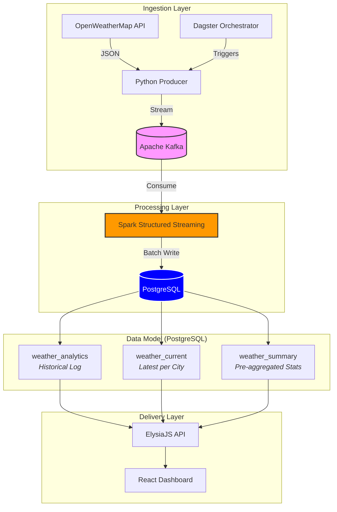

# Atmospheric Stack: Real-Time Weather ELT Pipeline

A robust, end-to-end data engineering pipeline and monitoring dashboard that ingests real-time weather data for global cities, processes it through a streaming engine, and visualizes it on a premium dark-themed dashboard.

## 🏗️ Architecture

The project follows a modern ELT (Extract, Load, Transform) pattern:



1.  **Ingestion**: A Python producer (orchestrated by **Dagster**) fetches data from the OpenWeatherMap API and streams it into **Apache Kafka**.
2.  **Processing**: **Apache Spark Structured Streaming** consumes the raw JSON from Kafka, flattens the schema, and writes to **three PostgreSQL tables** in each micro-batch:
    - `weather_analytics` — Append-only historical log.
    - `weather_current` — Latest reading per city (upsert).
    - `weather_summary` — Pre-aggregated stats (max/min temp, avg humidity, record count).
3.  **Storage**: The processed data lives in **PostgreSQL**, with pre-aggregated tables to minimize query load.
4.  **API**: An **ElysiaJS (Bun)** backend provides endpoints for latest data, historical logs, aggregated insights, and global summary stats.
5.  **Visualization**: A **React (Vite)** dashboard features a dark-mode **Leaflet** map with **marker clustering**, **Recharts** analytics, auto-refresh, and a searchable ingestion history.

## 🚀 Key Features

*   **50-City Global Monitoring**: Tracking weather across Americas, Europe, Africa, Asia, Oceania, and extreme climate locations.
*   **Live Stats Bar**: Top ribbon showing global extremes — 🔥 Hottest, ❄️ Coldest, 💧 Most Humid cities in real time.
*   **Marker Clustering**: Professional Leaflet MarkerCluster groups for clean zoom-out behavior on the dark map.
*   **Auto-Refresh**: 30-second polling with manual refresh button and pulsing green/red live indicator.
*   **Pre-Aggregated Analytics**: Spark writes to dedicated summary tables to reduce database load.
*   **Temperature Extremes Chart**: Top 10 hottest cities bar chart powered by Recharts.
*   **Searchable History**: Full tabular view of ingested records with city-based filtering.
*   **Full Orchestration**: Dagster scheduling (every 5 min) for continuous data ingestion.

## 🛠️ Tech Stack

| Layer | Technology |
| :--- | :--- |
| **Orchestration** | Dagster |
| **Message Broker** | Apache Kafka (Confluent) |
| **Stream Processing** | Apache Spark (Structured Streaming) |
| **Database** | PostgreSQL 15 |
| **Backend API** | Bun + ElysiaJS |
| **Frontend** | React 18 + Vite + Leaflet + MarkerCluster + Recharts |
| **Infrastructure** | Docker Compose |

## 📁 Project Structure

*   `orchestration/`: Dagster code, assets, and definitions.
*   `streaming/`: Kafka producer scripts for API data ingestion.
*   `processing/`: Spark streaming jobs for data transformation.
*   `backend/`: TypeScript backend served with Bun.
*   `frontend/`: Modern React dashboard source code.
*   `docker-compose.yml`: Full stack orchestration for all 9 services.

## 🚦 Getting Started

### 1. Prerequisites
*   [Docker](https://www.docker.com/get-started) & Docker Compose
*   [OpenWeatherMap API Key](https://openweathermap.org/api) (Free Tier)

### 2. Environment Setup
Create a `.env` file in the root directory:
```env
OPENWEATHER_API_KEY=your_api_key_here
```

### 3. Spin up the Infrastructure
```bash
docker-compose up -d
```

### 4. Trigger the Pipeline
1.  Open **Dagster UI** (Port 3000).
2.  Navigate to **Assets**.
3.  Click **Materialize All** to fetch weather data for all 50 cities.
4.  The Spark job (running in the background) will automatically detect the Kafka messages and populate three PostgreSQL tables.

## 📡 API Endpoints

| Endpoint | Description |
| :--- | :--- |
| `GET /api/weather/latest` | Latest reading per city (from `weather_current`) |
| `GET /api/weather/history?city=X` | Historical feed with optional city filter |
| `GET /api/weather/insights` | Pre-aggregated stats per city (from `weather_summary`) |
| `GET /api/weather/summary` | Global extremes: hottest, coldest, most humid, total records |

## 🔗 Port Mapping

| Service | URL |
| :--- | :--- |
| **Frontend Dashboard** | [http://localhost:5173](http://localhost:5173) |
| **Dagster UI** | [http://localhost:3000](http://localhost:3000) |
| **Backend API** | [http://localhost:8000](http://localhost:8000) |
| **Spark Master UI** | [http://localhost:8080](http://localhost:8080) |
| **Spark Worker UI** | [http://localhost:8081](http://localhost:8081) |
| **PostgreSQL** | `localhost:5432` |

## Screenshot


